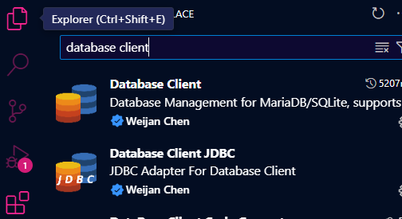

# BurguerManiaAPI 🍔🍔🍔

## 📖 EXECUTAR A API

---

## 🚀 Páginas

- **Página Inicial**  
  Página de apresentação.
  <div align="center">

  
  
  

  </div>

- **Página de Categorias**  
  Exibe diferentes categorias de hambúrgueres para facilitar a navegação.

    <div align="center">

  
  
   

  </div>


- **Página de Produtos**  
  Lista os produtos disponíveis em cada categoria, permitindo visualizar as opções.

  <div align="center">

  
  

  </div>


- **Detalhes do Produto**  
  Fornece informações detalhadas sobre um produto específico.
      
      

- **Página de Pedidos**
  


---

## 🛠️ Pré-requisitos

Certifique-se de ter o [Node.js](https://nodejs.org/) e o [Angular CLI](https://angular.io/cli) instalados em sua máquina antes de começar.

---

## 🖥️ Como executar o projeto (pelo vs code)

1. Instale a extensão database client no vs code:
  <div align="center">

  

  </div>
3. 
   ```bash
   npm install

   
4. Inicie o servidor de desenvolvimento, execute o comando:
      ```bash
      ng s
      
5. Navegue para http://localhost:4200/ no seu navegador.
  

